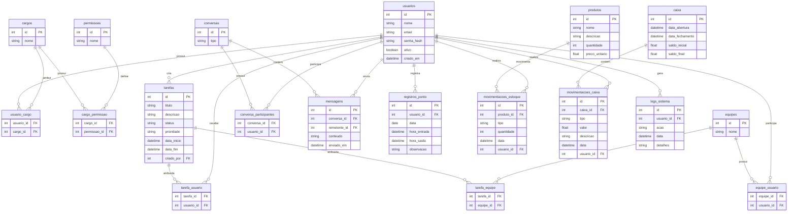

```mermaid
erDiagram

    usuarios {
        int id PK
        string nome
        string email
        string senha_hash
        boolean ativo
        datetime criado_em
    }

    cargos {
        int id PK
        string nome
    }

    permissoes {
        int id PK
        string nome
    }

    usuario_cargo {
        int usuario_id FK
        int cargo_id FK
    }

    cargo_permissao {
        int cargo_id FK
        int permissao_id FK
    }

    tarefas {
        int id PK
        string titulo
        string descricao
        string status
        string prioridade
        datetime data_inicio
        datetime data_fim
        int criado_por FK
    }

    tarefa_usuario {
        int tarefa_id FK
        int usuario_id FK
    }

    equipes {
        int id PK
        string nome
    }

    equipe_usuario {
        int equipe_id FK
        int usuario_id FK
    }

    tarefa_equipe {
        int tarefa_id FK
        int equipe_id FK
    }

    conversas {
        int id PK
        string tipo
    }

    conversa_participantes {
        int conversa_id FK
        int usuario_id FK
    }

    mensagens {
        int id PK
        int conversa_id FK
        int remetente_id FK
        string conteudo
        datetime enviado_em
    }

    registros_ponto {
        int id PK
        int usuario_id FK
        date data
        datetime hora_entrada
        datetime hora_saida
        string observacao
    }

    produtos {
        int id PK
        string nome
        string descricao
        int quantidade
        float preco_unitario
    }

    movimentacoes_estoque {
        int id PK
        int produto_id FK
        string tipo
        int quantidade
        datetime data
        int usuario_id FK
    }

    caixa {
        int id PK
        datetime data_abertura
        datetime data_fechamento
        float saldo_inicial
        float saldo_final
    }

    movimentacoes_caixa {
        int id PK
        int caixa_id FK
        string tipo
        float valor
        string descricao
        datetime data
        int usuario_id FK
    }

    logs_sistema {
        int id PK
        int usuario_id FK
        string acao
        datetime data
        string detalhes
    }

    usuarios ||--o{ usuario_cargo : possui
    cargos ||--o{ usuario_cargo : atribui

    cargos ||--o{ cargo_permissao : possui
    permissoes ||--o{ cargo_permissao : define

    usuarios ||--o{ tarefas : cria
    tarefas ||--o{ tarefa_usuario : atribuida
    usuarios ||--o{ tarefa_usuario : recebe

    equipes ||--o{ equipe_usuario : possui
    usuarios ||--o{ equipe_usuario : participa

    tarefas ||--o{ tarefa_equipe : atribuida
    equipes ||--o{ tarefa_equipe : recebe

    conversas ||--o{ conversa_participantes : possui
    usuarios ||--o{ conversa_participantes : participa

    conversas ||--o{ mensagens : contem
    usuarios ||--o{ mensagens : envia

    usuarios ||--o{ registros_ponto : registra

    produtos ||--o{ movimentacoes_estoque : movimenta
    usuarios ||--o{ movimentacoes_estoque : realiza

    caixa ||--o{ movimentacoes_caixa : contem
    usuarios ||--o{ movimentacoes_caixa : realiza

    usuarios ||--o{ logs_sistema : gera
```